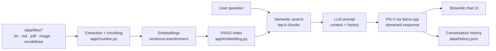

# Documentation Assistant AI

An AI-powered documentation assistant that helps users explore and understand documentation through natural language conversations. Built with Streamlit, llama.cpp (Phi-3), and FAISS for semantic search capabilities.

## Architecture



## Features

- 💬 Multi-conversation support (like ChatGPT)
- 🔍 Semantic search in documentation using FAISS
- 📝 Conversation history management
- 💾 Persistent storage of conversations
- 🤖 AI-powered responses using Phi-3 model
- 📚 Support for multiple document formats

## Prerequisites

- Python 3.10 or higher
- Poetry for dependency management
- NVIDIA GPU (optional, for faster inference)

## Installation

1. Clone the repository:

```bash
git clone https://github.com/rmouahid/doc-centralizer.git
cd doc-centralizer
```

2. Install dependencies using Poetry:

```bash
poetry install
```

3. Download the Phi-3 model:

```bash
bash scripts/download_model.sh
```

This fetches the quantized GGUF weights (`phi-3-mini-128k-instruct.Q4_K_M.gguf`, ~2.4 GB) into `models/`. Depending on your connection, this can take a few minutes. If the default source has moved, override it:

```bash
MODEL_REPO=<hf-user>/<hf-repo> MODEL_FILE=<file.gguf> bash scripts/download_model.sh
```

## Project Structure

```
doc-centralizer/
├── app/
│   ├── chunker.py         # Text extraction and chunking
│   ├── config.py          # Centralized configuration
│   ├── conversation.py    # Conversation management
│   ├── embedding.py       # Document embedding and search
│   ├── history.py         # Conversation history handling
│   ├── llm.py              # LLM integration
│   └── message.py          # Message data structure
├── data/
│   └── files/            # Documentation files (embeddings/index/cache are generated, not committed)
├── models/              # LLM model files (not committed, see Installation)
├── scripts/
│   └── download_model.sh # Fetches the Phi-3 GGUF weights into models/
├── Dockerfile
├── poetry.lock
├── pyproject.toml
└── streamlit_app.py     # Main application
```

## Usage

1. Place your documentation files in the `data/files/` directory.

2. Start the application:

```bash
poetry run streamlit run streamlit_app.py
```

3. The application will:

   - Process documents on first run
   - Create embeddings for semantic search
   - Build a FAISS index for efficient retrieval

> **Note:** The embeddings/index/chunks cache (`data/embeddings.npy`, `data/faiss.index`, `data/chunks_meta.json`) is automatically invalidated and rebuilt whenever a file in `data/files/` is added, removed or modified.

4. Use the interface to:
   - Create new conversations
   - Ask questions about your documentation
   - Switch between different conversations
   - Delete old conversations

## Running with Docker

The `models/` directory (LLM weights) is not baked into the image — mount it (along with `data/`) as volumes so the container uses your local files instead of copying multi-gigabyte weights into the image:

```bash
docker build -t doc-centralizer .
docker run -p 8501:8501 \
  -v $(pwd)/models:/app/models \
  -v $(pwd)/data:/app/data \
  doc-centralizer
```

## Tests

```bash
poetry run pytest
```

Tests run automatically on every push/PR via GitHub Actions (see `.github/workflows/tests.yml`). They cover the chunking, embedding/FAISS and conversation-history logic and do not require the LLM model file.

## Features Details

### Conversation Management

- Create multiple conversation threads
- Switch between conversations
- Delete conversations
- Persistent storage of conversation history

### Document Processing

- Automatic chunking of documents
- Generation of embeddings
- FAISS index for semantic search
- Support for various document formats

### AI Assistant

- Context-aware responses
- Conversation history awareness
- Natural language understanding
- Documentation-based answers

## Configuration

Key configuration constants in `app/config.py`:

- `MAX_TOKENS`: Token limit for document chunking
- `MAX_TOKENS_RESPONSE`: Token limit for AI responses
- `DIRECTORY_PATH`: Path to documentation files
- `EMBEDDINGS_FILE`: Path to stored embeddings
- `INDEX_FILE`: Path to FAISS index
- `CHUNKS_META_FILE`: Path to the cached chunks/metadata

## Contributing

1. Fork the repository
2. Create a feature branch
3. Commit your changes
4. Push to the branch
5. Create a Pull Request

## License

This project is licensed under the MIT License — see [LICENSE](LICENSE) for details.
